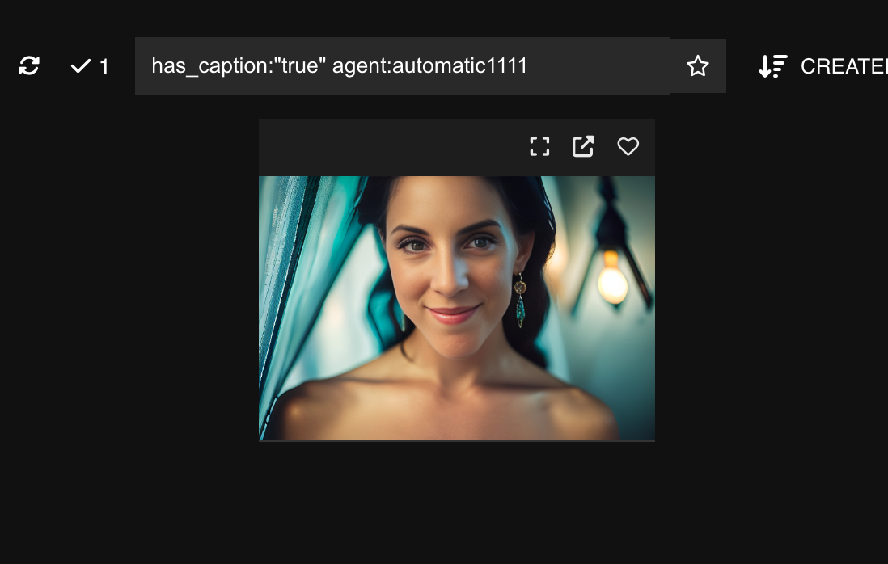
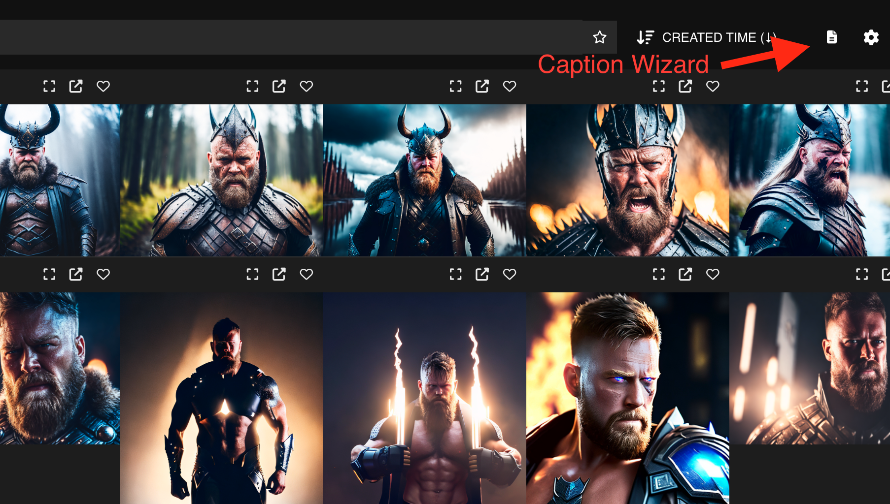
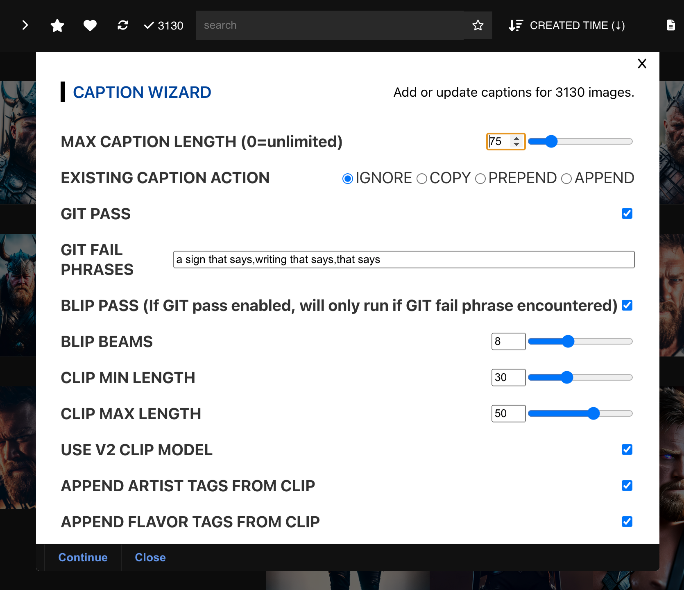

# Breadboard (With Captions)

A fork of coktailpeanut/breadboard designed to improve image captioning workflow.
This is an untested early alpha. Use at your own risk.

## To Use
Add your image dataset to the Connected Folders section in settings and Re-Index
It will add any existing caption files to the database, allowing searchability.
Captions are now searchable, and images can be filtered by whether they have a caption or not:
https://github.com/theovercomer8/breadboard/raw/main/imgs/search.png

### Caption Wizard
The caption wizard can be accessed in the toolbar:

It will apply captioning to any selected images, or all images visible within the current filter if none are selected.

#### Wizard Options
- **Max Caption Length** Maximum tags to use
- **Existing Caption Action** How to handle existing caption if present
- **GIT Pass** Whether to perform a pass using Microsoft's GIT model
- **GIT Fail Phrases ** Don't use GIT caption if it contains one of these phrases
- **BLIP Pass** Caption using BLIP model if selected and/or GIT fail phrase detected
- **BLIP Beams** Number of beams for BLIP pass
- **CLIP Min/Max Length** Number of tags to use from CLIP
- **CLIP V2 Model** Currently broken, can ignore
- **APPEND (Artist/flavor/method/movement/medium) Tags from CLIP** If any of these are selected, will perform a CLIP tag pass
- **Tags to ignore** Comma seperated, will not add matching tags to caption
- **Replace class with subject in caption** Will perform a find/replace on subject class and replace with subject name after tags are generated
- **Use folder as tag** Will tag the image with the parent folder names. Useful if you have images grouped by artist/style/subject
- **Folder levels to tag** Number of nested parent folders to add as tags
- **Write caption to file** Will only write to txt file if checked. Otherwise, it will just display the new caption in the status window. Useful for doing preview runs without modifying existing caption files
- **Use filename as existing caption** Will parse the filename to use as the existing caption

 

# Alpha release
## To Run
Clone this repo

run `pip install -r requirements.txt`

run `npm install`

run `npm run`
